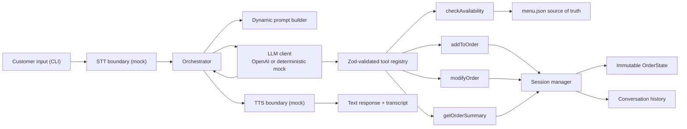

# Vima3ya Restaurant Steward Voice Agent

A production-oriented TypeScript orchestration layer for a restaurant steward voice agent. It connects mocked speech boundaries to a reasoning client, typed tools, deterministic session state, a JSON-backed menu, and a CLI. The implementation prioritizes correct orchestration, state, and grounding over UI or model infrastructure.

The project runs without credentials through a deterministic mock LLM. Supplying an OpenAI API key enables the optional Vercel AI SDK client.

## Architecture



The orchestrator owns the turn lifecycle: transcribe input, append history, build a prompt with current state, bind tools to the session, request reasoning, record the answer, update reference context, and pass the answer to mocked TTS. The session keeps both a human-readable transcript and SDK-native model history, including structured assistant tool calls and matching tool results across turns. Only typed tools mutate order state; the LLM receives state as read-only context.

## Requirements

- Node.js 20 or newer
- npm
- Optional: an OpenAI API key for real model calls

## Run

```bash
npm install
npm run dev
```

The default mode is fully local and deterministic. Type `quit` to print the final order and save a timestamped transcript under `logs/`.

To use the optional OpenAI path, copy `.env.example` to `.env`, set `OPENAI_API_KEY`, and load those variables in your shell before starting the CLI. `OPENAI_MODEL` defaults to `gpt-4o-mini`. Set `LLM_MODE=mock` to force deterministic mode even when a key is present.

## Build and test

```bash
npm run build
npm run test
```

The eighteen focused tests demonstrate:

1. Mid-conversation cancel-and-replace intent handling
2. Unavailable-item rejection with grounded alternatives
3. Correct immutable state through add/update/remove operations
4. Rejection of items absent from the menu dataset
5. Enforcement of limited quantities
6. Structured assistant tool-call and tool-result history across turns
7. Dietary-compatible alternatives for unavailable items
8. Price and description questions that never mutate the order
9. Item-specific vegan answers
10. Whole-order clearing
11. Grounded mild-item recommendations
12. Greetings, thanks, and goodbyes
13. Reference resolution sourced from session context
14. Unavailable-item rejection for “what about” inquiries
15. “Changed my mind” remove-and-replace corrections
16. Adding a previously removed item back through pronoun context
17. Item-specific gluten-free tag answers
18. Rejection of signed negative quantities

Regenerate both checked-in sample transcripts by driving the actual CLI in
deterministic mock mode:

```bash
npm run logs:generate
```

## Grounding and state guarantees

- `src/data/menu.json` is the sole source for item names, IDs, prices, descriptions, tags, spice levels, and availability.
- Name lookup is case-insensitive and supports partial matches. Ambiguous matches return all candidates so the agent can clarify rather than guess.
- `OrderState` is not LLM memory. Pure functions return new objects and recalculate quantity counts and totals.
- Tools revalidate menu existence, availability, quantities, and cart membership before each mutation.
- Veg Biryani is limited to three units; Fish Amritsari and Mutton Rogan Josh are unavailable with explicit reasons.
- The current order and last-mentioned item ID are injected into every system prompt.

## Design decisions and tradeoffs

### Vercel AI SDK instead of LangChain

The SDK supplies typed tool calling and a bounded multi-step tool loop with much less framework surface. This keeps the assessment focused on orchestration. The cost is fewer prebuilt chains, which are unnecessary for this small domain.

### Explicit state instead of model memory

The model cannot directly edit the cart. Tool calls pass through a `SessionManager` and immutable order functions, making totals deterministic and independently testable. In a production deployment the same interface could be backed by Redis or a transactional order service.

### Zod schemas at the tool boundary

Every model-supplied argument is validated before tool execution. This reduces malformed or invented tool parameters and keeps runtime contracts aligned with TypeScript types.

### Dual reasoning modes

`OpenAIClient` uses the Vercel AI SDK and a five-step tool loop. `MockLLMClient` provides deterministic intent handling for development, demos, and tests without network access or credentials. The mock is deliberately domain-specific; it is a reliable fallback, not a general-language replacement for an LLM.

### Pure state functions

Pure add/remove/update functions make mutations transparent and easy to test. Copying small state snapshots has negligible cost for a table-sized order but would need a different persistence strategy at larger scale.

## Assumptions

- One CLI process represents one table session.
- Prices are integer INR amounts; taxes, service charges, payment, and fulfillment are outside scope.
- `limitedQuantity` is enforced per session because no shared inventory backend is part of the assessment.
- Text typed into the CLI stands in for transcribed audio; mocked TTS returns deterministic metadata and does not play sound.
- A reference such as “make it two” is resolved only when recent context identifies a safe target; otherwise the agent asks for clarification.
- The real model path requires a valid API key and network access. All verification tests use the deterministic client.

## Project structure

```text
src/
  data/menu.json
  engine/               # LLM abstraction, prompt construction, orchestration
  mocks/                # STT and TTS boundaries
  state/                # Menu access, immutable order logic, session memory
  tools/                # Typed business tools and Zod registry
  types/                # Menu, order, and conversation contracts
  config.ts
  index.ts               # CLI entry point
tests/                   # Five focused Vitest cases
scripts/                 # Reproducible CLI-driven sample-log generator
logs/                    # CLI-generated samples + runtime transcripts
```

## Sample conversations

Both files below are generated by `npm run logs:generate`, which pipes scripted
customer turns through `src/index.ts` and uses the CLI's normal transcript writer.

- [Happy-path ordering and quantity change](logs/conversation-ordering.log)
- [Unavailable item and mid-conversation correction](logs/conversation-edge.log)
